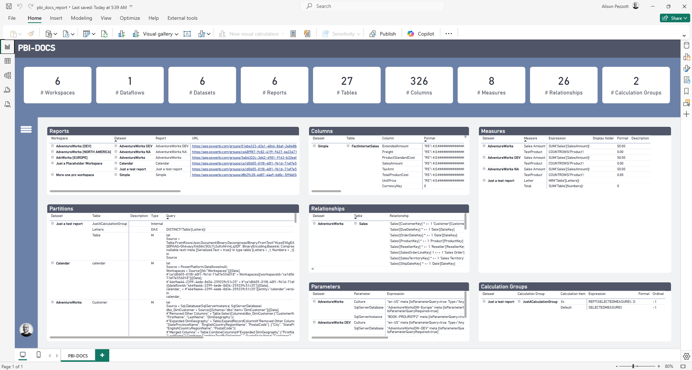
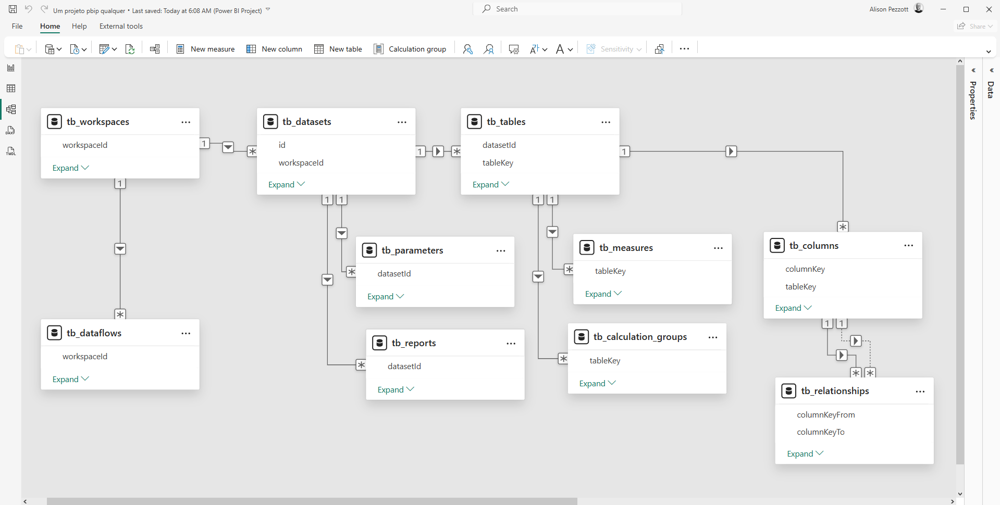

[](https://github.com/alisonpezzott/pbi-docs/blob/main/LICENSE) 


# PBI-DOCS  

## What is it?  
### A simple (yet powerful) Python script

This script extracts documentation for Power BI artifacts on the Tenant using:

- Power BI REST APIs with SPN
- DAX Studio CLI
- Power BI Desktop

All combined with some logic. 🤯

## How does it work?  

```mermaid
flowchart TD
    A[Start] -->|Request access token| B[get_token]
    B -->|Fetch tenant metadata| C[get_tenant_metadata]
    C -->|Save JSON files| D[Save metadata to results/tenant_metadata]
    
    D -->|Extract dataset information| E[get_info_datasets]
    E -->|Run DAX queries| F[Generate CSV files for each dataset]
    F -->|Save to results/datasets_info| G[Save dataset info]
    
    D -->|Export dataflows JSON| H[get_dataflows]
    H -->|Save JSON files| I[Save to results/dataflows_json]
    
    D -->|Identify PRO datasets| J[get_pro_datasets]
    J -->|Export PBIX files| K[Save to results/exported_pbix]
    
    K -->|Extract dataset info from PBIX| L[get_info_pro_datasets]
    L -->|Run DAX Query locally| M[Generate CSV files for each dataset]
    M -->|Save to results/datasets_info| N[Save dataset info]
    
    G & N -->|Generate documentation| O[create_documentation]
    O -->|Save DOCX files| P[Save to results/documentation]
    
    P -->|Process completed| Q[End]
```


This is a native Python script that runs locally. Besides Python itself and some additional libraries, you need to have DAX Studio and Power BI Desktop installed on the machine that will run the code. 
Every Power BI developer should already have these installed, right? 😄
See more details in the `Installation` section.

### Inside the code!

>[!NOTE]
>The script is written with `def` functions that segment each step, making it easier and clearer to debug and maintain the code.

### get_token
When running the script, this function requests the access_token using the Service Principal properly configured in Microsoft Entra.

### get_tenant_metadata
With the obtained access_token, this function makes several requests to the POWER BI REST APIs to extract the tenant metadata, saving the .json files in the `results/tenant_metadata` folder. These files contain metadata for workspaces, dataflows, datasets, and reports. Each json file includes the necessary IDs and hashes to reconstruct the entire environment. After completing this step, the file structure will be as follows:

```lua
pbi-docs(repo-root)/
│-- results/
│   │-- tenant_metadata/
│       │-- dataflows.json
|       |-- datasets.json
|       |-- reports.json
|       |-- workspaces.json

```  
  
### get_info_datasets
This function is undoubtedly the most disruptive part of this process 😱.  
With the metadata extracted from the tenant, we connect each dataset with the DAX Studio CLI and run a DAX query to obtain all tables, columns, measures, relationships, calculation groups, and much more...

> [!IMPORTANT]
> At this point, only datasets with workspaces in dedicated capacities (Fabric, Embedded, and PPU) are executed as they depend on the XMLA Endpoint, which is not available for PRO licensing. But I developed a cool feature that also includes PRO users 🫴.

The DAX queries generate 6 *.csv files for each dataset and save them in the `results/datasets_info/` folder, creating more subfolders. For example, for `Dataset A` in `Workspace A`, it would look like:

```
   results/datasets_info/Dataset A/Workspace A/partitions.csv
   results/datasets_info/Dataset A/Workspace A/columns.csv
   results/datasets_info/Dataset A/Workspace A/measures.csv
   results/datasets_info/Dataset A/Workspace A/relationships.csv
   results/datasets_info/Dataset A/Workspace A/parameters.csv
   results/datasets_info/Dataset A/Workspace A/calculation_groups.csv
```  
The file tree would look like this:

```lua
pbi-docs(repo-root)/
│-- results/
│   │-- datasets_info/
│       │-- Workspace A/
|           |-- Dataset A/
|               |-- partitions.csv
|               |-- columns.csv
|               |-- measures.csv
|               |-- relationships.csv
|               |-- parameters.csv
|               |-- calculation_groups.csv
|           |-- Dataset B/
|               |-- partitions.csv
|               |-- columns.csv
|               |-- measures.csv
|               |-- relationships.csv
|               |-- parameters.csv
|               |-- calculation_groups.csv
│       │-- Workspace C/
|           |-- Dataset C/
|               |-- partitions.csv
|               |-- columns.csv
|               |-- measures.csv
|               |-- relationships.csv
|               |-- parameters.csv
|               |-- calculation_groups.csv
```
  

> Yes, this is the same DAX query I developed in July 2024 to obtain the documentation of a dataset locally. I just gave it a boost 😎  
> See the old repository [here.](https://github.com/alisonpezzott/documentacao-daxstudio)  

### get_dataflows  

This function exports the JSON files of each dataflow from the tenant. It is advisable to keep these files for potential recoveries and migrations. They are saved in the `dataflows_json` folder with the following structure in the file name:

```
Pattern:
workspace_name$dataflow_name.json

Examples:
Workspace A$Dataflow A.json
Workspace B$Other Dataflow.json

```

### get_pro_datasets  

_Remember when I said I hadn't forgotten about PRO users?_  

This function goes to the tenant_metadata folder and filters the datasets that are not in dedicated capacities, listing only the PRO datasets and exporting them to the local `results/exported_pbix/` folder using a similar structure to the previous sections, adopting the workspace as subfolders.

```lua
pbi-docs(repo-root)/
│-- results/
│   │-- exported_pbix/
│       │-- Workspace A/
|           |-- Dataset A.pbix
|           |-- Dataset B.pbix
│       │-- Workspace C/
|           |-- Dataset A.pbix
|           |-- Dataset D.pbix
```

> [!IMPORTANT]
> The API method used is reports/export. There is no method to export the Dataset itself, but using this method to export the report, it brings the dataset along. Obviously, this method does not cover reports that are in direct mode with other datasets. Therefore, always maintain a standard report connected to the dataset, so you can obtain the data through this standard report.  
> See more at: https://learn.microsoft.com/en-us/rest/api/power-bi/reports/export-report-in-group  

### get_info_pro_datasets  

This function, similar to the premium datasets, obtains the tables, columns, measures, etc., from the exported PBIX files and adds the data to the `datasets_info` folder.  
The difference here is that since we do not have the XMLA to connect the DAX Studio CLI to the dataset, we are opening Power BI Desktop with each PBIX file and running the DAX Query locally. Once the data is extracted, Power BI Desktop is automatically closed, and this cycle is repeated for each PBIX file. Amazing, right?  

### create_documentation  

Having all the extracted data in their respective directories, this function creates a Microsoft Word `.docx` document for each of the extracted datasets and saves them in the `documentation` folder with the file name in the format `workspace_name$report_name.docx`.

## Instalation  

> [!IMPORTANT]
> Follow these steps one by one carefully. 

1. Ensure that you have the following softwares already installed:  
    1. Microsoft Power BI Desktop [MS Store](https://apps.microsoft.com/detail/9NTXR16HNW1T)    
    2. DAX Studio [Download here](https://github.com/DaxStudio/DaxStudio/releases/download)
    3. Python [python.org](https://www.python.org/downloads/)  
    4. Libs pandas pythonnet psutil pydocx  
      - If you don't have, run: `pip install pandas pythonnet psutil pydocx`
    5. VS CODE [MS Store](https://apps.microsoft.com/detail/XP9KHM4BK9FZ7Q)
    6. Git [Download here](https://git-scm.com/downloads)  
2. Open [GitHub Repo](https://github.com/alisonpezzott/pbi-docs). Fork and Clone to VS Code!;
3. Click on `src/pbi_docs-v1.0.py`
4. Open the Power BI Desktop. With the Power BI Desktop still opened open the Task Manager (CTRL+ALT+DEL). On the running apps find the Power BI Desktop taks and expand. Click with the right button and then `Open Path`. Find file PBIDesktop.exe and click on and then `Copy as path`.
Paste in the code at the constant `pbi_desktop` for example:    
```python
# Path Power BI Desktop
pbi_desktop = r"C:\Program Files\WindowsApps\Microsoft.MicrosoftPowerBIDesktop_2.140.1205.0_x64__8wekyb3d8bbwe\bin\PBIDesktop.exe"`
```  
5. Check if the paths of DAX Studio components are correctly referenced for example:
```python
# Path DAX Studio CLI
cmd = r"C:\Program Files\DAX Studio\dscmd.exe"
# Path Analysis Services
ssas_dll = r"C:\Program Files\DAX Studio\bin\Microsoft.AnalysisServices.dll"
```
6. Service Principal App configured on Portal Azure (Entra) 
7. Recomended configure on environment variables (or Key Vault) 
8. Enabled API's and XMLA on Fabric Portal Admin
9. Run the script
10. Enjoy your documentation on `results` folder!  
11. Share with the Community! 🚀

## Power BI Report

On folder `pbi` you can refresh the Power BI Report with a case of use of the result files. 🤯  
Just confirm the path on parameter on the Power BI.  Enjoy!  

  

  


## Contributing

We welcome contributions from the community! If you have suggestions, bug reports, or want to contribute code, please follow these steps:

1. Fork the repository on GitHub.
2. Create a new branch with a descriptive name.
3. Make your changes and commit them with clear and concise messages.
4. Push your changes to your forked repository.
5. Open a pull request to the main repository.

Please ensure your code adheres to the project's coding standards and includes appropriate tests. We appreciate your contributions and look forward to collaborating with you!

## License

This project is licensed under the MIT License. See the [LICENSE](https://github.com/alisonpezzott/pbi-documentation/blob/main/LICENSE) file for more details.

## Contact

For any questions or inquiries, please reach out to us via the GitHub repository's issue tracker or contact the project maintainer directly.

Thank you for using and contributing to PBI-DOCS! Let's make data documentation easier and more efficient together! Let's keep pushing the boundaries of Microsoft Fabric and Power BI Communities! 🚀

## 🙋‍♂️ Support

If you like this project, give it a ⭐ and share it with friends!

[](https://www.youtube.com/channel/UCst_4Wi9DkGAc28uEPlHHHw?sub_confirmation=1)
[](https://github.com/sponsors/alisonpezzott)
[](https://linkedin.com/in/alisonpezzott)


